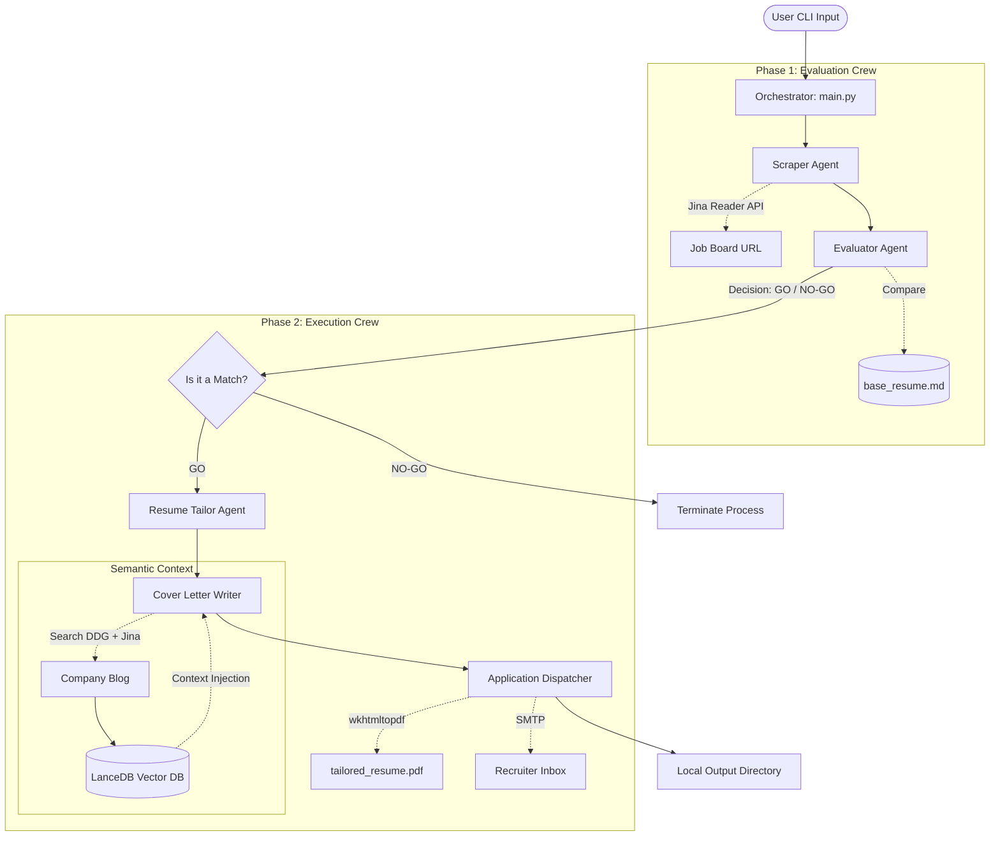

# Multi-Agent Job Apply: Architectural Design Document

## 1. Executive Summary
The **Multi-Agent Job Apply** system is an automated, AI-driven workflow built with Python and **CrewAI**. It leverages Google's **Vertex AI (Gemini 2.5 Flash)** to analyze job postings, evaluate candidate fit, and auto-generate tailored application materials (Resume PDF and Cover Letter). 

## 2. System Architecture
The architecture is split into two distinct sequential phases to prevent hallucinated applications and ensure human oversight.

## 3. Core Architectural Decisions

### 3.1. Phased Crew Execution
**Problem:** Allowing an AI to scrape a job, rewrite a resume, and email it in one continuous loop is dangerous. It might apply for jobs you are utterly unqualified for.
**Solution:** We split the execution into two separate `Crew` instances:
- **Evaluation Crew:** Reads the job and outputs a strict `Decision: GO` or `Decision: NO-GO`.
- **Execution Crew:** Only runs if Phase 1 returns a `GO`.

### 3.2. Human-in-the-Loop (HITL) Dry Runs
By default, the application operates in a "Dry Run" mode before actually dispatching an email. 
- Files are generated in an `output/<Company_Name>` folder.
- The user can review the `tailored_resume.pdf` and `email_dry_run.txt` before confirming dispatch.

### 3.3. Tool Abstraction
Custom Python tools (`JinaReaderScraperTool`, `MarkdownToPDFTool`, `SMTPEmailTool`, `CompanyContextRAGTool`) wrap complex logic so the CrewAI agents only need to know *what* to do, not *how* to do it. The RAG tool specifically utilizes ephemeral, in-memory **LanceDB** to perform high-speed semantic searches on scraped company data to inject deep organizational alignment into cover letters.

## 4. Scalability & Deployment
Currently designed as a local CLI tool. Future architectures may involve migrating this into a fastAPI backend with a React UI for managing hundreds of concurrent applications.
